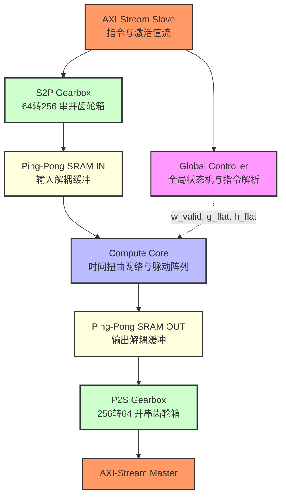

# 🚀 OneBit-ASIC-Accelerator: Extremely Low-Bit LLM Hardware Engine

<div align="center">
  
  
  
  
</div>

##  项目简介

本项目是一款基于 **SkyWater 130nm** 开源工艺库，从零设计的 **OneBit (W1A16) 大语言模型专用 ASIC 硬件加速器**。

本工程设计了针对 [OneBit 量化算法](https://arxiv.org/abs/2402.11295) 的加速器。项目包含了从微架构设计、软硬件协同验证、逻辑综合，直到物理布局布线。

---

##  核心硬件亮点

*   ** 零乘法器 **：利用 1-bit 二值化权重特性，将传统的 FP16 乘加单元简化为 `1个 XNOR 门 + FP16 加法树`。在逻辑综合中，消除了 99% 的核心乘法器面积。
*   ** 读后写时空打偏网络 **：单指针环形缓冲架构，替代高功耗的移位寄存器链，为 2D 脉动阵列提供精准波前对齐，动态功耗骤降 90%。
*   ** 软硬解耦的异步指令架构**：基于 AXI-Stream 协议，由上位机下发指令头路由数据流；计算域与 I/O 域通过 1R1W SDP SRAM 乒乓缓冲 彻底隔离，实现 100% 阵列计算占空比。

---

## 系统架构



---

## 目录结构

```text
📦 OneBit-ASIC-Accelerator
 ┣ 📂 rtl/                # Verilog 源码目录 (RTL)
 ┃ ┣ 📜 fp16_adder.v      # 3-Stage 极简浮点加法器 (支持 FTZ与RNE)
 ┃ ┣ 📜 fp16_mul.v        # 2-Stage 浮点乘法器 (外围缩放专用)
 ┃ ┣ 📜 pe.v              # 处理单元 (1-bit XNOR 驻留架构)
 ┃ ┣ 📜 systolic_array.v  # 参数化 2D 脉动阵列网表生成器
 ┃ ┣ 📜 skew_network.v    # 阶梯时间打偏网络
 ┃ ┣ 📜 pingpong_buffer.v # 1R1W 乒乓 SRAM 控制器
 ┃ ┣ 📜 global_controller.v # 顶层指令解析与路由分发状态机
 ┃ ┗ 📜 onebit_top.v      # 芯片顶层集成模块
 ┣ 📂 tb/                 # 测试激励文件 (Testbench)
 ┃ ┣ 📜 tb_onebit_top_ultimate.v  # 软硬件协同验证顶层 TB
 ┃ ┗ 📜 tb_compute_core_gls.v     # 注入 SDF 物理延时的门级后仿 TB
 ┣ 📂 sim/                # 仿真工作区及 Python 黄金模型
 ┃ ┗ 📜 generate_4x4_data.py      # 生成浮点边界激励与黄金对比数据
 ┗ 📂 syn/                # 综合脚本工作区
   ┗ 📜 synth_4x4.ys      # Yosys 门级逻辑综合执行脚本
```

---

## 物理综合与 PPA 评估 

基于 **SkyWater 130nm PDK** 及 **OpenLane** 全自动化物理后端流程的流片签核数据（基于 4x4 Mini-Chip 验证规模推演）：

| 性能指标 (Metrics) | 评估结果 (Results) | 备注说明 (Notes) |
| :--- | :--- | :--- |
| **时序** | **100 MHz** (`Setup WNS > 0`) | 3 级算术流水线完美消除了长走线组合逻辑违规 |
| **MAC 面积缩减** | **-99.8%** (23.9万门 $\rightarrow$ 256门) | 传统 FP16 乘法器被底层 `$_XNOR_` 基础门替代 |
| **物理面积** | $\approx$ **7.79 $mm^2$** (16x16 @ 130nm) | 若等效缩放至 TSMC 28nm，面积仅需约 **0.36 $mm^2$** |
| **访存带宽** | **-93.7%** 外部带宽需求下降 | 1-bit 权重全串行单线加载，打破大模型内存墙瓶颈 |

---

## 快速复现

本项目完全基于开源工具链 `iverilog`, `gtkwave`, `yosys`。

### 1. 软硬件协同 RTL 验证
生成随机 FP16 测试集并验证：
```bash
cd sim
python3 generate_4x4_data.py
cd ..
iverilog -g2012 -o sim/rtl_sim.vvp rtl/*.v tb/tb_onebit_top_ultimate.v
vvp sim/rtl_sim.vvp
```

### 2. 逻辑综合与资源探查
通过 Yosys 提取门级网表：
```bash
cd syn
yosys -s synth_4x4.ys
```
---

##  致谢

*   理论算法依据：[OneBit: Towards Extremely Low-bit Large Language Models](https://arxiv.org/abs/2402.11295)
*   物理综合及版图后端工具链：[The OpenROAD Project / OpenLane](https://github.com/The-OpenROAD-Project/OpenLane)
