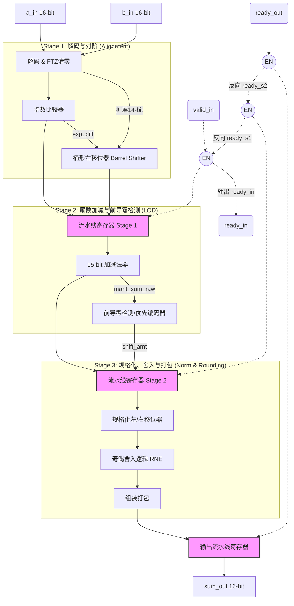
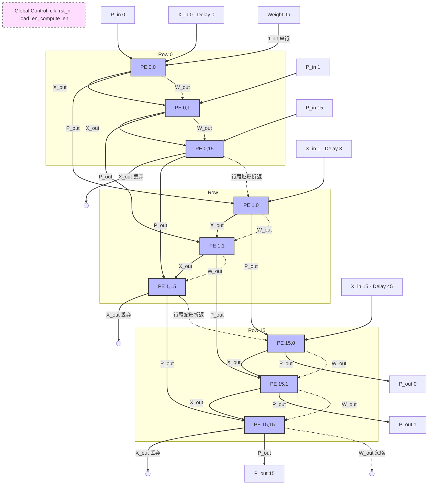
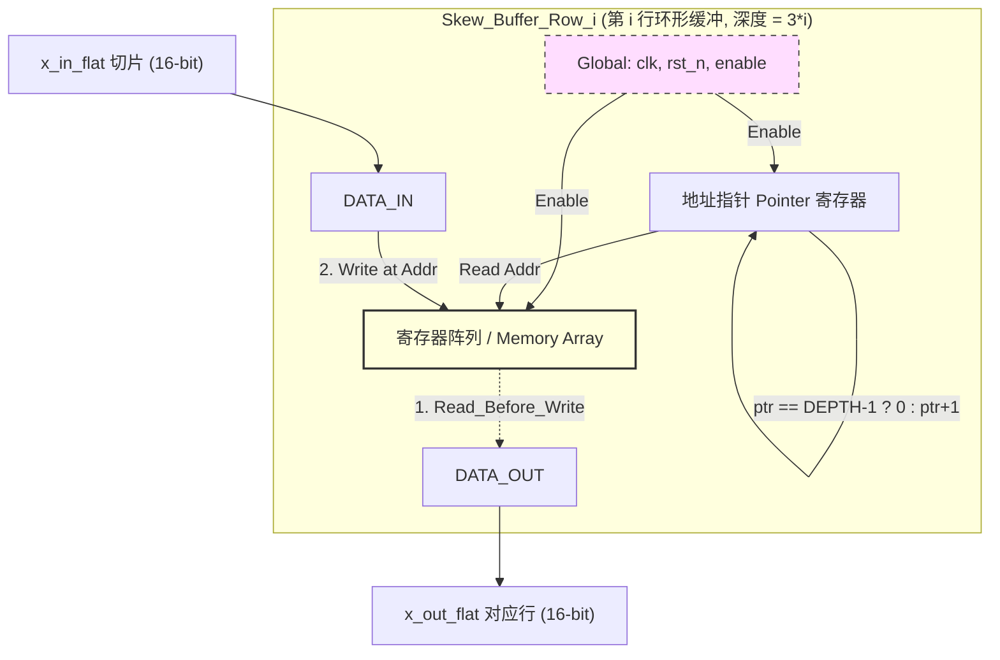

# OneBit W1A16 大语言模型 ASIC 加速器设计规范
**版本:** v0.1 (Draft)  
**状态:** Work In Progress (WIP)  
**目标工艺:** SkyWater 130nm (OpenLane Open-source ASIC Flow)  

## 1. 项目概述 (Project Overview)
本项目旨在基于纯开源 ASIC 工具链，设计并验证一款针对 OneBit 大语言模型量化算法（W1A16）的硬件加速器。
核心目标是利用 OneBit 极低比特的权重优势，通过“消除乘法器”的硬件红利，设计一个低功耗、高频、面积紧凑的二维脉动阵列。

### 1.1 算法映射基础
OneBit W1A16 线性层公式：$Y = [ (X \odot g) W_{\pm 1}^T ] \odot h$
*   **激活值 ($X$)**：FP16（半精度浮点）
*   **权重 ($W_{\pm 1}$)**：1-bit（0 表示 -1，1 表示 +1）
*   **缩放因子 ($g, h$)**：FP16
*   **硬件优势**：矩阵乘法阶段 ($X \times W_{\pm 1}^T$) **无 FP16 乘法器**，完全由“符号取反 + FP16 累加”替代。

---

## 2. 工具链与开发环境 (Development Environment)
本项目采用 100% 免费开源的 Linux/WSL2 ASIC 工具链。
*   **RTL 编写与仿真**: Icarus Verilog (`iverilog`) + GTKWave
*   **逻辑综合**: Yosys
*   **自动布局布线 (P&R) 与 GDSII 生成**: OpenLane / OpenROAD
*   **目标 PDK**: sky130 (SkyWater 130nm)
*   **参考模型 (Golden Model)**: PyTorch (用于生成输入激励与比对结果)

---

## 3. 顶层系统架构 (Top-Level Architecture)

### 3.1 外部接口 (TBD - 待后续细化引脚)
*   **总线协议**: AXI-Stream (带有 Valid/Ready 握手机制)
*   **时钟与复位**: `clk`, `rst_n` (全同步主动低复位)

### 3.2 核心模块划分
1.  **乒乓 SRAM 控制器 (Ping-Pong Buffer Controller)**: 支持数据传输与计算深度 Overlap。
2.  **输入打偏网络 (Skewing Network)**: 为 2D 脉动阵列提供带有阶梯时钟延迟的输入激活值。
3.  **计算核心 (Compute Core)**:
    *   前处理 FP16 乘法阵列 ($X \odot g$)
    *   **16x16 权重驻留 (WS) 脉动阵列** (核心计算区)
    *   后处理 FP16 乘法阵列 ($S \odot h$)
4.  **全局状态机 (Global FSM)**: 控制数据流加载、计算节拍与乒乓切换。

---

## 4. 微架构设计细节 (Micro-architecture Details)

### 4.1 FP16 流水线加法器 (PE 核心算子)
*   **位宽与格式**: 16-bit，符合 IEEE 754 格式 (1-bit Sign, 5-bit Exp, 10-bit Mantissa)。
*   **异常处理策略**: **FTZ (Flush-To-Zero)**，输入极小非规格化数直接清零；忽略 NaN/Inf。
*   **舍入策略**: **RNE (Round to Nearest, ties to Even)**，奇偶舍入。
*   **流水线划分 (3-Stage)**:
    *   *Stage 1*: 尾数恢复、指数做差、对阶右移。
    *   *Stage 2*: 尾数加减法运算、保留 G/R/S 保护位、前导零检测 (LOD)。
    *   *Stage 3*: 规格化左/右移、RNE 舍入逻辑、组装输出。

#### 加法器设计详述

**(1) 控制通路: 流水线握手逻辑**

流水线寄存器的更新条件（Enable 信号）采用业界标准的 valid/ready 双向握手机制：

*   **更新规则**: `assign ready_current = ready_next || !valid_current;`
*   **原理解析**: 只有当"下一级已经准备好接收数据（`ready_next == 1`）"，或者"当前级的数据本来就是无效的空泡（`!valid_current`）"时，当前级的寄存器才可以打入新数据。该逻辑构成一张向后传递的反压网，确保下游阻塞时上游自动停顿。

**(2) Stage 1: 解码、FTZ 检查与尾数对阶**

*   **FTZ (Flush-To-Zero)**: 直接检测指数 `exp == 5'b00000`，一旦成立，连同尾数直接视作全 0。该策略在综合时砍掉了一大块极耗面积的边界处理电路。
*   **隐含位扩展**: 标准 FP16 尾数为 10-bit，加上隐含位为 11-bit。本设计将其左移 3 位扩展为 14-bit，低 3 位即为 G(Guard)、R(Round)、S(Sticky) 保护位。
*   **桶形右移位器**: 指数较小的数向右移动 `exp_diff` 位对齐，RTL 中用 `>>` 描述，综合工具将其映射为多路选择器（MUX Tree）构成的组合逻辑移位器，单周期完成任意位数移位。

**(3) Stage 2: 尾数加减法与 LOD**

*   **加减法器**: 两个 14-bit 尾数进行加/减运算，最高位（第14位）保留用作进位标志（`carry_out`）。
*   **前导零检测 (LOD)**:
    *   **用途**: 减法结果可能出现高位为 0（如 `1.000... - 0.111... = 0.000001...`），需计算左移位数以使最高位 1 回到规格化位置。
    *   **硬件实现**: RTL 中使用 `for` 循环描述，综合时被展平（Unroll）为从高到低的优先编码器（Priority Encoder），不消耗额外时钟周期，输出移位量 `shift_amt`。

**(4) Stage 3: 规格化、RNE 舍入与打包**

*   **规格化移位**:
    *   加法溢出（`carry_out == 1`）时，尾数右移 1 位，指数加 1。
    *   减法产生前导零时，尾数左移 `shift_amt` 位，指数减 `shift_amt`。
*   **奇偶舍入 (RNE)**:
    *   根据 G、R、S 保护位判断是否进位：`round_up = (G & (R | S)) | (G & ~R & ~S & LSB)`。
    *   该逻辑表示：超出部分 > 0.5 时进位；= 0.5 时，若最低位 LSB 为 1（奇数）则进位凑偶，完美匹配 PyTorch 默认精度。
*   **再溢出与打包**: 舍入加 1 可能导致尾数再次满溢（如 `11.111 + 0.001 = 100.000`），电路二次检测溢出并调整最终指数，最后拼装为 16-bit 浮点数输出。

### 4.2 处理单元 (Processing Element, PE)
*   **面积优化**: 内部无 FP16 乘法器。
*   **关键逻辑**:
    *   1-bit D触发器 (`w_reg`) 驻留当前权重。
    *   XOR 逻辑：`assign x_mod = {x_in[15] ^ ~w_reg, x_in[14:0]};`
    *   例化 3 级流水线 FP16 加法器，完成 `p_out = p_in + x_mod`。

#### PE设计详述

**(1) PE 整体数据流**

PE 内部包含三条主要数据通路：

*   **权重通路 (Weight Path)**: 1-bit 串行输入 `w_in`，在 LOAD 模式下逐级移位，通过 `w_out` 传递给下一个 PE。
*   **激活通路 (Activation Path)**: 16-bit 输入 `x_in`，经过 3 级延迟线后通过 `x_out` 输出到右侧相邻 PE。
*   **部分和通路 (Partial Sum Path)**: 16-bit 输入 `p_in`，与乘法结果 `x_mod` 相加后通过 `p_out` 输出到下方相邻 PE。

**(2) 状态隔离与控制逻辑**

*   **LOAD 模式**: `load_en = 1` 时，`w_reg` 在每个时钟周期从 `w_in` 更新，形成贯穿整个阵列的移位寄存器链。此时 `compute_en = 0`，加法器流水线暂停，所有 `valid` 信号被屏蔽，防止无效数据进入浮点运算单元。
*   **COMPUTE 模式**: `compute_en = 1` 时，`w_reg` 被锁定，权重值固定参与后续所有乘加运算。此时 `load_en = 0`，权重移位链断开，外部 `w_in` 被忽略。

**(3) 零成本乘法器实现**

*   **数学原理**: 二值化权重 $w \in \{+1, -1\}$。在硬件中，`w=1` 表示原值传递，`w=-1` 表示取反。
*   **硬件映射**: 仅需一个异或门（XOR2）完成符号翻转：
    *   当 `w_reg = 1` 时：`x_mod = x_in`（符号位不变）
    *   当 `w_reg = 0` 时：`x_mod = ~x_in`（符号位翻转，等价于 $-x$）
*   **面积优势**: 传统 FP16 乘法器需要约 2000 个逻辑门，而 XOR2 仅需 4 个晶体管，面积缩小约 **500 倍**。

**(4) 时空对齐延迟线设计**

*   **延迟线结构**: 3 级移位寄存器，每级包含 16-bit 数据寄存器和 1-bit valid 标志。
*   **握手控制**: 延迟线受 `ready_x` 信号控制，与 `fp16_adder` 的 `ready_in` 联动，确保在反压发生时数据同步停顿。
*   **延迟匹配**: `X` 经过 3 拍到达 `x_out`，与 `P` 经过 3 级加法器流水线到达 `p_out` 的延迟完全一致，确保相邻 PE 在对角线方向同时收到有效数据。

**(5) 流水线时序对齐**

*   **对齐原理**: 激活值 $X$ 在水平方向每经过一个 PE 延迟 3 拍，部分和 $P$ 在垂直方向每经过一个 PE 也延迟 3 拍。因此波前始终保持在对角线方向同步推进。
*   **反压处理**: 当某一行下游 PE 阻塞（`ready_out = 0`）时，反压信号向上游逐级传递，延迟线和加法器同时暂停，保持数据一致性。

### 4.3 权重加载 (Weight Loading)
*   **架构**: 256-bit 串行移位链 (Daisy Chain)。
*   **机制**: 在 `weight_load_en` 拉高时，通过单根数据线，历经 256 个时钟周期将权重视为串行比特流“挤”入 16x16 阵列的每一个 PE 中。
*   **综合约束注意**: 该信号需设置 Multi-Cycle Path 或 False Path 处理，并添加 Buffer 以防止 Hold Time 违规。

---

## 5. 项目推进里程碑 (Project Milestones)

### 阶段一：核心算子开发 (Phase 1) - [进行中]
- [ ] 定义 FP16 Adder 接口
- [ ] 编写 Stage 1: 对阶逻辑
- [ ] 编写 Stage 2: 加减法与 LOD
- [ ] 编写 Stage 3: 规格化与奇偶舍入
- [ ] 编写独立的 FP16 Adder Testbench (对比 PyTorch 半精度加法)

### 阶段二：PE 与阵列集成 (Phase 2) - [未开始]
- [ ] 封装单 PE RTL (`pe.v`)
- [ ] 编写 16x16 阵列连线与权重移位链 (`systolic_array.v`)
- [ ] 编写阵列左侧输入延迟打偏逻辑 (Skewing Network)

### 阶段三：顶层控制与乒乓缓冲 (Phase 3) - [未开始]
- [ ] 实现 Ping-Pong SRAM 逻辑
- [ ] 实现 AXI-Stream 状态机
- [ ] 软硬件协同验证 (Python/PyTorch 导出数据 -> Iverilog 读入并比对)

### 阶段四：物理设计与后仿 (Phase 4) - [未开始]
- [ ] Yosys 门级综合 (生成 Netlist)
- [ ] OpenLane 物理实现 (Floorplan, CTS, Routing)
- [ ] 提取 SDF 延时文件
- [ ] 运行带 SDF 的门级后仿并进行 Sign-off

---
*注：本文档将随着项目每个阶段的完成而更新详细的接口信号定义、时序图以及面积/功耗报告。*